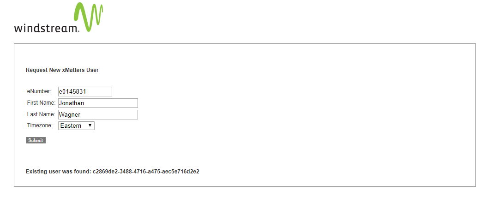

# xm-labs-createusers

This is a data-source integration allowing for the automation of adding groups of users or single users via web-form

# Files
**index.php**
This is the file that loads in your webbrowser and displays a simple form (you can add your own css )

**loading-1-1-.gif** 
Loading image for form processing

**doquery.php**
Actual heart of the individual add. Be sure to update the appropriate usernames, passwords, and company names as well as xMatters API keys 

**batchcreate.php**
Performs CLI based batch addition of multiple users. Be sure to replace appropriate usernames, passwords, company names, and API keys

**newxmattersusers.csv**
file containing a list of users to be added in the batch add. username, lastname, firstname, timezone

# How it works
*GUI*
User fills out the form and receives an email with instrucitons on how to add devices, subscribe to subscriptions etc. System checks to see if userid exists if it does not a new user is created if it does then an error is displayed.

*CLI*
Batch is loaded and each username is displayed as created or not created.

When the script runs successfully either from the single user GUI or from the batch script the individual users will receive the following email: (it needs to be customized for each company )

**NOTE: The Users email address is pulled from the LDAP server configureation.**

**NOTE: I BCC myself on the email in order to track who was created when. I have logs but its nice to have the email incase tehy ask for them again.**

# Prerequisites
This script requires that PHP Version 5.3.3 at least (Has not been tested with older PHP versions) There is nothing which has been depricated so should work in with PHP 7 without issue.
You can get more information about PHP at [php.net](http://php.net/) and specifically about PHP on CENTOS 6 at: [RedHat.com](https://www.redhat.com/en/search/PHP) 

# Installation
put all files in a directory on a server that has access to your xMatters servers... if you intend to use the GUI then this should also have a webserver with appropriate php libaries etc.

# Who Can Use This
The GUI can be used by anyone who can reach the webpage (so if you don't want everyone in your org using it don't put it somewhere people can get to.   At Windstream we use this to create Standard USers so they can subscribe to outages and other notifications without having to bother an administrator.

In order to utilize the CLI you have to be able to ssh to the server where the CLI exists and have suitable permissions to run the script.  **NOTE: The SCRIPT MUST HAVE an Administrator level user configured in order to work properly**  

# Testing
load the gui fillout the form. if you don't use a valid LDAP username the script will fail.

The batch file runs from the BLI as such
php batchcreate.php

and in this case it failed because the users exist:

Here is the GUI failure for an existing user:

# Troubleshooting
If your LDAP is configured differently you may need to adjust how the authentication is completed going to the LDAP/ AD server

